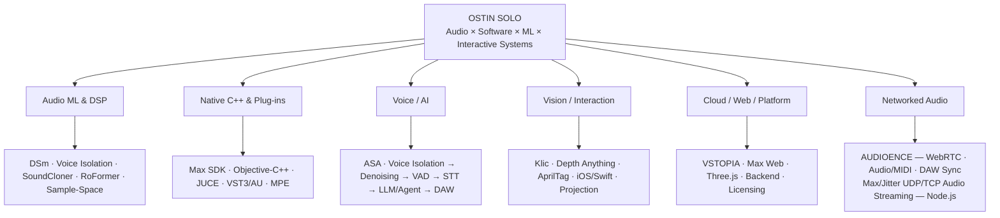

# Agostino Scalzullo

**Audio Software & Creative Technology Engineer**
C++ · DSP · JUCE · Max/MSP · Audio ML · Deep Learning · Real-Time Systems · Computer Vision

London, UK
**OSTIN SOLO · Founder, VSTOPIA**

**Email:** contact@ostinsolo.co.uk
**VSTOPIA:** contacts.vstopia@gmail.com
**GitHub:** `ostinsolo` · `VSTOPIA`

---

## Profile

Audio software developer and electronic musician working across **C++, Max/MSP, JUCE, DSP, real-time audio, networking, hardware integration, computer vision and audio machine learning**.

Founder of **VSTOPIA**, an independent platform for music-production software, and developer behind the **OSTIN SOLO** range of commercial audio tools.

Work spans the complete engineering path from low-level hardware and operating-system APIs through native Max externals and DSP engines to VST3/AU plug-ins, networked audio systems, cloud infrastructure, deployment, licensing and commercial distribution.

Alongside released products, maintains an extensive R&D portfolio covering **Max/RNBO systems, native DSP, neural audio processing, real-time source separation, computer vision, WebRTC, hardware protocols, interactive visual systems, audio embeddings/classification, empirical evaluation and custom developer tooling**.

A recurring focus is turning experimental technologies into practical musical systems while using **benchmarks, controlled experiments, profiling and quantitative evaluation** to guide architecture and optimisation.

## Core Technologies

**Languages / Frameworks:** C · C++ · Objective-C++ · Swift · SwiftUI · JUCE · Max/MSP · Max SDK / Min API · JavaScript · TypeScript · Python · Node.js · CMake

**Audio / DSP:** Real-time audio processing · VST3 / AU · synthesis · source separation · STFT · spectral processing · spatial audio · MIDI / MPE · audio buffering · low-latency systems

**Networking / Backend:** WebRTC · UDP · TCP · WebSockets · Socket.IO · REST APIs · MongoDB · Opus · RTP MIDI · OSC · real-time communication · cloud deployment

**Systems / Hardware:** macOS native integration · Objective-C++ bridging · Apple frameworks · Arduino · ESP32 · MCP23017 I/O expansion · microcontroller firmware · MIDI SysEx · Bluetooth control · capacitive touch · servo/actuator control · AVFoundation · Core ML · Apple Neural Engine · IOKit / IOUSBHost · shared memory · USB devices · multitouch · cameras · sensors · Developer ID signing · Hardened Runtime · notarization

**ML / Deep Learning / Computer Vision:** Neural audio processing · BS-RoFormer · Demucs · MossFormer2 · ECAPA speaker embeddings · target-speaker extraction · speaker enrollment / identity tracking · CLAP/audio embeddings · classification · similarity retrieval · Core ML · MLX · MediaPipe Tasks Vision · ARKit · Depth Anything · AprilTag · real-time face/landmark tracking · model deployment, distillation and optimisation

**Interactive / Evaluation:** Three.js · interactive graph interfaces · benchmark design · profiling · scaling tests · parity/regression testing · experimental evaluation

**Cross-Platform Build Engineering:** macOS Apple Silicon & Intel · Windows x64 / ARM64 · cross-architecture toolchains · conditional compilation · CMake · release packaging

**Research / Tooling:** performance benchmarking · WebAssembly · WebGL · native SDK integration · deployment and licensing systems

---

## Professional Experience

### Founder & Audio Software Developer — VSTOPIA | 2023–Present

Founded and developed an independent ecosystem for music-production software, Max for Live devices and plug-ins. Work includes audio-software/product development, technical architecture, backend/web infrastructure, developer onboarding and distribution, licensing/update systems, deployment, commercial delivery and long-term support.

### Independent Audio Software Developer — OSTIN SOLO | 2018–Present

Designer and developer of commercial Max for Live tools, plug-ins and experimental music technology spanning DSP, machine-learning-assisted processing, hardware controllers, MIDI/MPE systems, computer vision, networked audio and interactive audio-visual technology.

### Founder, Artistic Director & Experience Designer — Macrowave / Cacao Discoteca / Basement | 2014–2016

Directed multidisciplinary electronic-music and multimedia programmes in Italy, including events with audiences of up to **3,000** and extended-format programmes lasting up to 24 hours. Work covered artist curation, production coordination, scenography, projection mapping, interactive installations, interior/venue identity and coordination with performers, technicians, venues and suppliers.

---

## Native Max/MSP Externals & Plug-in Engineering

A major current engineering direction is the migration of earlier **Max for Live prototypes into native C++ Max/MSP externals and conventional plug-in/application targets**. This work moves core functionality out of patch-level implementations and into reusable native components, with selected systems being developed toward **VST3, Audio Unit and standalone** builds through JUCE/native C++ architectures.

### RoFormer Native External & Plug-in Runtime — Work in Progress
**C++ · Max SDK · JUCE · VST3/AU · MLX · BS-RoFormer · Real-Time Neural Audio**

Developing a native Max/MSP external and plug-in-oriented C++ runtime integrating BS-RoFormer source separation for real-time / near-real-time musical use. The work targets **six-stem neural separation** in Max/MSP and an in-development **VST3/AU architecture**, built around native MLX C++ inference, model/runtime optimisation, buffering and Apple Silicon performance engineering.

### Depth Anything / Computer-Vision Externals
**C++ · Max/Jitter · Core ML · Apple Neural Engine · Depth Anything V2 · AprilTag**

Developed native Max/Jitter computer-vision externals including `jit.depthanything`, bringing Depth Anything V2 inference directly into Jitter through Core ML / Apple Neural Engine execution. Related native components cover AprilTag detection, depth/geometry processing and camera-to-projection workflows.

### OpenMultitouch / Klic Native External Family
**C++ · Max SDK · Multitouch · Hardware APIs · MPE · macOS / Windows**

Developed a family of native Max/MSP externals that expose multitouch input and computer hardware/sensor data directly to musical applications. Rather than a single Max object, the native package includes several purpose-built externals:

- **`klic`** — multitouch capture and raw touch data with pressure/gesture information and MPE-oriented musical mapping.
- **`klic.ui`** — visual/instrument-oriented multitouch interface supporting expressive piano/drum-pad style interaction.
- **`lidangle`** — native access to MacBook display/hinge angle for mapping physical computer movement into musical or interactive control.
- **`gyroscope`** — three-axis gyroscope/sensor data exposed to Max for continuous control and interaction.
- **`accelerometer`** — accelerometer data, including orientation-derived roll/pitch information for musical mapping.

The work spans native hardware communication, multitouch state management, pressure and gesture processing, MPE voice allocation and platform-specific macOS/Windows integration.

### Earlier Physical Computing & Hardware Prototyping
**Arduino · ESP32 · MCP23017 · Capacitive Touch · Sensors · MIDI · Bluetooth · Servo Control**

Earlier physical-computing work established a practical hardware base before the more recent native Max, plug-in and computer-vision systems. Prototypes included microcontroller firmware, sensor acquisition, physical controls, MIDI mapping and electromechanical control rather than software-only simulations.

Built an **Arduino/MCP23017 controller with eight rotary encoders and four push-button inputs**, using I/O expansion to increase the number of physical controls available from the microcontroller. Additional musical-control experiments included a **ribbon/position sensor mapped to MIDI pitch control** and a **12-channel capacitive-touch MIDI controller** in which changes at individual conductive inputs triggered note/control events.

Developed a **servo-driven projector positioning platform** controlled from a phone, supporting both accelerometer-based motion input and direct on-screen controls for pan/tilt movement. The communication path was first prototyped with an external Bluetooth module and later reworked around an **ESP32 with integrated Bluetooth**.

These projects involved wiring, sensor/control mapping, firmware programming and modification, microcontroller-to-host communication, MIDI generation and physical debugging across electronics and software boundaries.

### Native macOS Integration & Runtime Bridging
**C · C++ · Objective-C++ · Max SDK · Apple Frameworks · Hardware APIs · Native ML Runtimes**

Developed native bridge layers that connect reusable C/C++ engines to the Max SDK and to platform-specific macOS services. This includes Objective-C++ bridge layers where C++ systems need to cross into Apple frameworks, C-compatible wrapper boundaries around native components, and host-facing glue used to expose low-level functionality safely through Max externals.

Built platform-specific integration for hardware, sensors and operating-system services using native Apple APIs, including communication paths that sit below the Max patching layer. The same bridging approach allows DSP, computer-vision, multitouch and hardware-control engines to remain primarily C/C++ while selectively accessing macOS-specific frameworks where required.

Designed runtime/resource layouts for distributing machine-learning systems with Max externals, including model discovery/loading, native inference dependencies and bridges between Max object lifecycles, C++ inference code and platform runtimes. This work supports moving ML functionality from research executables into deployable musical-software components rather than treating the model as an external standalone process.

As an **Apple Developer Program member**, handles the direct-distribution workflow for macOS audio software, including **Developer ID code signing, Hardened Runtime configuration and Apple notarization** for independently distributed plug-ins, applications and native components.

### MPE Externals
**C++ · Max/MSP · MIDI Polyphonic Expression · Multitouch**

Developed native MPE-oriented Max externals that translate multitouch interaction into polyphonic expressive musical control, including independent per-note dimensions, voice allocation and continuous gesture mapping. Per-touch state is maintained across the complete note lifecycle so expressive dimensions can remain associated with the correct musical voice.

### MPE VST3 / AU Instrument — In Development
**C++ · JUCE · VST3 · Audio Unit · MPE · Expressive UI · Logic Pro Integration**

Developing a native JUCE/C++ plug-in that extends the OpenMultitouch/Klic interaction system beyond Max and Max for Live into a DAW-independent **MPE performance tool**. The plug-in reuses the native touch-capture, voice-allocation and MPE-mapping architecture while providing a dedicated multidimensional expressive interface inspired by modern continuous-touch instruments.

The MIDI architecture assigns and maintains **per-voice MPE channels** so that note-on, pitch bend, pressure, timbral/continuous control and note-off events remain associated with the same touch/voice throughout a gesture.

Logic Pro required additional host-specific engineering because its multichannel/MPE handling can conflict with unrestricted per-note channel routing. A dedicated **MIDI channel filtering/routing strategy** was therefore developed to constrain the active MPE channel range and isolate the required per-voice traffic, preventing unintended simultaneous note triggering and channel collisions inside Logic. This host-specific compatibility layer sits alongside the core C++ MPE engine rather than changing the underlying expressive-control model.

**VST3 and Audio Unit** are the primary plug-in targets, with standalone deployment possible from the same JUCE/native architecture.

### Native Product Transition

The broader product-engineering direction is increasingly **Max for Live → native Max external → VST3/AU/standalone**, choosing the appropriate target per project. This includes extracting reusable DSP, ML inference, hardware interaction and expressive-control layers into C++ components that can be shared across hosts and products.

---

## Portfolio Architecture

<strong>Visual map — projects, systems and engineering domains</strong>

---

## Selected Technical Work

### Web-Based Max/MSP Environment — Work in Progress
**Max/MSP · RNBO · JavaScript · Web Technologies · Interactive Graphs · Rendering · Automated Testing**

Developing a browser-based environment aimed at representing and recreating core **Max/MSP patching workflows on the web**. The work goes substantially beyond documentation browsing: it models Max objects and their relationships as a connected system, represents patch-style object graphs in an interactive browser interface, and investigates how native Max behaviours can be reproduced faithfully in a web runtime.

**Public demo — static preview:** [Open the browser demo](https://ostinsolo.github.io/max-object-network-demo/). The GitHub Pages build exposes the interactive 3D object graph, search/filtering, Inspector/reference data and reconstructed Help Patch viewer. It intentionally does **not** execute Max/MSP message logic, MSP/DSP audio processing, Jitter processing or Max for Live/Ableton control; the executable runtime remains in development.

Engineering and research include:
- Parsing and structuring Max object/documentation data into a machine-readable relationship graph.
- Interactive object and connection graphs for navigating the Max ecosystem and patch structures.
- Browser-side representation of object boxes, connections and patching interactions.
- Max/RNBO compatibility and web-export analysis.
- Reconstruction of UI/rendering behaviour for web presentation.
- Automated visual comparison and **pixel-parity testing** to measure rendering fidelity.
- Behavioural and regression testing rather than relying only on manual visual inspection.
- Investigation of how Max-style workflows can be represented across native and browser execution environments.

The long-term objective is a **web-accessible Max/MSP-style environment** capable of preserving recognisable patching concepts and workflows while exploiting browser-native interaction, visualisation and deployment.

### Audio Intelligence & Sample-Space Exploration System
**C++ · Python · CLAP / Audio Embeddings · Classification · Similarity Retrieval · Three.js · DSP · Evaluation Engineering**

Developing an R&D system for automatic analysis, classification and interactive navigation of large audio/sample collections. Rather than treating samples as files organised only by folders or metadata, the system builds a machine-derived audio space that can be explored through **similarity, learned embeddings, classifiers and perceptual/musical descriptors**.

The project combines:
- **CLAP/audio-embedding research** and classifier training for semantic/perceptual audio categorisation.
- Similarity and retrieval systems for locating related sounds in learned feature spaces.
- An interactive **Three.js graph / spatial interface** for visually exploring relationships between samples.
- Audio-analysis and DSP pipelines covering extraction, onset/slicing, loop analysis, corpus construction and scoring.
- Native C++ migration and parity work for performance-critical stages.
- Formal benchmarks, profiling and scaling studies across pipeline components.
- Case studies, controlled comparisons and evaluation metrics used to measure progress between implementations and guide subsequent engineering decisions.

A central part of the project is **evaluation engineering**: building baselines, measuring accuracy/performance, identifying bottlenecks and using experimental results to decide which models, representations and native implementations should be pursued next.

### OpenMultitouch / Klic
**C++ · Max/MSP Externals · Hardware Integration · Multitouch · MPE**

Developed native Max externals exposing multitouch hardware and computer sensor data to musical applications. Work includes pressure handling, MPE voice allocation, trackpad-to-instrument mapping, Apple Silicon motion-sensor access, lid angle, gyroscope/accelerometer data, macOS/Windows implementations and native C++ work extended into JUCE/VST3 research.
**Evidence:** [OpenMultitouch Externals](https://ostinsolo.co.uk/devices) · [OSTIN SOLO product catalogue](https://ostinsolo.co.uk/devices)

### Split Wizard+ → DSm — Dynamic Split Module
**Audio DSP · Neural Source Separation · Max for Live · Audio ML**

Developed **Split Wizard+**, a Demucs/Hybrid Transformer-based Max for Live stem-separation system integrated directly into Ableton Live by 2023, before stem separation became a native Ableton Live feature.

The released project evolved into **DSm — Dynamic Split Module** by merging and substantially extending two earlier product lines: **Split Wizard+**, focused on neural source separation, and **YouTube 4 Live**, focused on web-based audio discovery and sampling inside Ableton Live. DSm unifies those ideas into a broader neural audio-processing, web-sampling and model-driven workflow supporting multiple separation architectures and restoration tools inside Ableton Live / Max for Live.

The work has been covered by specialist music-technology publications including **Sound On Sound** and **Gearnews**.
**Evidence:** [Official product](https://vstopia.com/max-for-live-devices/dynamic-split-module) · [Cycling ’74 project](https://cycling74.com/projects/dynamic-split-module-websampler-with-63-audio-separation-models-in-ableton-1) · [Sound On Sound coverage](https://www.soundonsound.com/news/vstopia-announce-dynamic-split-module-ableton)

### AUDIOENCE — Networked Real-Time Audio & DAW Synchronisation
**C++ · JUCE · WebRTC · Real-Time Audio · MIDI · Cross-Platform Systems**

Developed a collaborative audio plug-in architecture for synchronising audio, MIDI and DAW timing across networked music-production systems.

Engineering includes WebRTC bidirectional audio, Opus, RTP MIDI, beat-phase-aware buffering, DAW synchronisation, adaptive prebuffering, jitter compensation, underrun recovery, remote audio/MIDI timing alignment, sample-rate conversion, circular/ring buffers, real-time `processBlock()` integration and JavaScript↔native C++ communication.

Platform-specific development covers **Apple Silicon macOS, Intel macOS and Windows**, with dedicated compatibility work including a **WebGL 1 fallback path**.
**Evidence:** [AUDIOENCE official page](https://vstopia.com/audioence) · [Technical manual](https://vstopia.com/audioence-manual)

### Max/MSP UDP/TCP Audio Streaming & Voice Processing
**Max/MSP · Jitter · Node.js · UDP · TCP · Float32 Audio · Vosk**

Developed and published a standalone reference implementation for low-latency audio transport from **Max/MSP or Ableton Live to Node.js**. Audio is captured through Max/Jitter as Float32 matrices, transmitted over UDP (with a separate TCP path), decoded and buffered in Node.js, and can be routed into Vosk-based speech recognition or other downstream audio processing.

The public repository includes dedicated UDP sender/receiver scripts, TCP transport, audio-buffer management and Max/Node integration examples. **Evidence:** [MaxMSP Audio via UDP for Voice Recognition](https://github.com/ostinsolo/MaxMSP-Audio-via-UDP-for-voice-recognition).

### VSTOPIA / AUDIOENCE Realtime Backend
**TypeScript · Node.js · WebSockets · MongoDB · WebRTC · Cloud Infrastructure**

Designed and developed production backend infrastructure supporting networked VSTOPIA/AUDIOENCE services: REST APIs, Socket.IO/WebSockets, geolocated public/private rooms, end-to-end encrypted private messaging, audio/MIDI file transfer, MongoDB Atlas data modelling and geospatial queries, indexing, automated message/room/file lifecycle management, WebRTC/WebTorrent integration, cloud media/avatar infrastructure, Heroku deployment, credential management and production debugging.

### Depth Anything / Native Computer Vision
**C++ · Max/Jitter · Core ML · Computer Vision · Apple Neural Engine**

Developed a Max/Jitter package integrating native real-time computer vision directly into Max, including Depth Anything V2 via Core ML/ANE, native AprilTag detection from Jitter matrices, projection-mask/mesh-warp editing and real-time camera/projection workflows.

### MakeUp App — iOS Real-Time Computer Vision R&D
**Swift · SwiftUI · iOS · ARKit · SceneKit · AVFoundation · MediaPipe Tasks Vision · Real-Time Computer Vision**

Developed an iOS computer-vision application for **real-time guided physical makeup**, using live camera input and facial landmark tracking to align makeup guidance/effects with the user’s face. The project extends the portfolio beyond desktop/audio systems into native mobile development and on-device vision workloads.

Engineering work includes a native **Swift/SwiftUI** application architecture, ARKit/SceneKit camera and overlay integration, AVFoundation-based camera workflows, MediaPipe Tasks Vision integration, real-time facial/eye landmark processing and experiments with model-driven vision on Apple mobile hardware. The eyeliner MVP was developed through iterative simulator and physical-device validation, including TrueDepth/device-specific testing of camera, landmark and overlay behaviour.

### SoundCloner
**C++ · DSP · Synthesis · Audio Analysis · Machine Learning**

Research platform for reconstructing synthesiser sounds from reference audio. Built around a deterministic native C++ synthesis engine with oscillators, envelopes, modulation, saturation, EQ, reverb, soft clipping and real-time-safe processing. The wider system combines procedural sound generation, parameter/genome representations, similarity scoring, candidate retrieval, search/optimisation, ML parameter inference and large synthetic training/rendering infrastructure. The research process uses controlled experiments, retrieval metrics, benchmark sets and measured comparisons to evaluate successive architectures rather than relying on qualitative listening alone.

### RoFormer Realtime / Neural Audio Optimisation — External & Plug-in R&D
**C++ · MLX · BS-RoFormer · Audio Source Separation · Performance Engineering**

Developed and benchmarked the native MLX C++ BS-RoFormer runtime used for the **Max/MSP external and in-development VST3/AU work**, including native model execution, transformer inference, fast attention paths, memory optimisation, benchmark/regression infrastructure and real-time/near-real-time deployment research. These measurements refer to the native external/plug-in R&D, **not to the released DSm product**.

**Measured performance:** Across tested Apple Silicon workloads, native C++/MLX optimisation achieved a **median 1.85× speedup**, reaching **2.5× on MelBand RoFormer** while preserving validated output parity. Native MLX C++ six-stem BS-RoFormer maintained **bit-exact parity with the Python MLX reference** and achieved **RTF ≈ 0.36 (~2.8× real time)** on an **Apple M4 Pro**.

### Real-Time Target-Speaker Voice Isolation — R&D
**MossFormer2 · ECAPA · Target-Speaker Extraction**

Developed a real-time system that learns a target speaker profile and suppresses competing voices using neural source separation and speaker embeddings.

### Multi-Camera / AprilTag Performance Engine
**C++20 · AVFoundation · IOUSBHost · AprilTag · OSC · Shared Memory**

Developed a standalone multi-camera engine with independent camera workers, AVFoundation/direct USB capture, POSIX shared-memory frame transport, native AprilTag detection, OSC output, latest-frame-only processing, camera identity/reconnection logic and performance/backend testing.

### ASA — Voice-Controlled Ableton / Computer Assistant
**Voice Interfaces · Ableton Live · Automation · Human–Computer Interaction**

Developed an early voice-controlled system for Ableton Live and general computer workflows. The project attracted direct interest from **Ableton**, leading to technical discussions and project review under NDA. Ableton ultimately pursued a different design approach and no commercial collaboration resulted.

### Commercial Software Deployment & Licensing Infrastructure
**Max · Automation · Licensing · Cryptography · Software Updates**

Developed private infrastructure for processing, packaging and deploying commercial Max for Live software, including automated device workflows, licensing integration, protected distribution, update delivery, packaging, server integration, per-install identity research and signed update manifests.

---

## Benchmarking, Validation & Cross-Platform Test Methodology

Testing and evaluation are treated as an engineering discipline across projects rather than as project-specific completion metrics. Work includes:

- **Controlled benchmarks:** repeatable test corpora, fixed evaluation conditions, baselines and before/after comparisons for DSP, ML and retrieval systems.
- **Performance profiling:** latency, throughput, memory/runtime behaviour and scaling tests for real-time audio, neural inference and interactive systems.
- **Cross-machine validation:** comparative testing across Apple Silicon and Intel Macs, Windows systems and different GPU/acceleration paths where supported, including MPS, CUDA and CPU execution.
- **Cross-platform / host validation:** DAW and plug-in behaviour across Max/MSP, VST3/AU workflows and platform-specific host constraints; simulator and physical-device validation for iOS work.
- **Regression and parity testing:** automated and manual checks used to preserve behaviour while moving systems between implementations, runtimes or interfaces.
- **ML evaluation:** held-out datasets, retrieval metrics, best-of-K comparisons, controlled experiments and ablation-style investigations used to identify whether model, representation or search/ranking changes produce measurable improvements.
- **Hardware-in-the-loop testing:** cameras, multitouch devices, sensors, projection systems and other physical interfaces validated against real hardware rather than simulator-only assumptions.

This methodology is used across audio ML, native plug-ins/externals, computer vision, web/interface reconstruction and interactive hardware systems.

## Additional Software & R&D Projects

- **MagicTrackpad MPE:** Polyphonic expressive instrument translating multitouch position, pressure and gestures into MPE; native Max external work now extending into VST3/AU plug-in development.
- **Preview Tuner:** Pitch-analysis/sample-tuning utility developed from a production-workflow concept by **Connor Patrick McDonough**, a multi-platinum, ASCAP award-winning songwriter/producer with three #1 records. [McDonough Productions](https://www.mcdonoughproductions.com/) · [Artist Publishing Group profile](https://www.artistpg.com/producers/connormcdonough)
- **Harmodulum / Pendolo:** Physics-driven generative musical systems in Max/MSP. **Evidence:** [Cycling ’74 — Pendolo](https://cycling74.com/projects/pendolo).
- **Web Player VST3 (unreleased R&D):** JUCE/VST3 media-player architecture combining web-based discovery/interface layers with native plug-in playback, networking, embedded WebView integration and provider abstraction.
- **Real-Time Multimedia VST3 R&D:** JUCE/VST3 architecture involving lock-free FIFO systems and audio/video synchronisation.
- **Audio-to-MIDI research:** Automatic transcription, onset analysis and structured musical-information extraction.
- **Envelope-Matched Noise Reduction:** STFT-based adaptive denoising for amplitude-correlated noise.
- **Projection Mapping / Interactive Performance Systems:** Computer vision, AprilTags, cameras, projection mapping and audience interaction.
- **Voice-Controlled Ableton research:** Local STT, language models, agents and DAW-control architectures.

---

## Web / Platform Engineering

### VSTOPIA Web Platform
Designed and developed web infrastructure supporting VSTOPIA's commercial software ecosystem, including product presentation, developer/distribution workflows, software delivery, user-facing services and backend integration.

The wider platform history includes production web/backend work across Laravel, Node/Express, React/TypeScript, PostgreSQL, Docker, Hetzner/Traefik infrastructure and licensing/update services. AUDIOENCE's realtime production backend uses Heroku + MongoDB and is kept distinct from VSTOPIA's primary hosting architecture.

---

## Commercial / Industry Track Record

- Founder and developer of **VSTOPIA**.
- Developer of the **OSTIN SOLO** catalogue of commercial music-production software.
- Experience taking projects from experimental R&D through production, packaging, deployment, licensing, updates and support.
- Software used by professional producers and musicians.
- Developed **Preview Tuner** from a workflow concept by multi-platinum producer/songwriter **Connor Patrick McDonough**.
- Direct technical interaction with **Ableton** following its interest in the ASA voice-control project.
- Audio-software work covered by specialist publications including **Sound On Sound** and **Gearnews**.
- Production backend/cloud infrastructure experience alongside native audio applications.

## Areas of Particular Interest

Digital musical hardware · Embedded/constrained audio systems · Max/MSP · RNBO · Native C++ DSP · Hardware/software integration · New musical interfaces · Real-time audio · Networked music systems · Spatial/interactive audio · Interactive graph systems · Audio embeddings/classification · target-speaker extraction · speaker-conditioned audio · computer vision for musical interaction · Audio ML · Native neural-audio deployment · Experimental evaluation · Performance optimisation · Cross-platform audio systems

---
