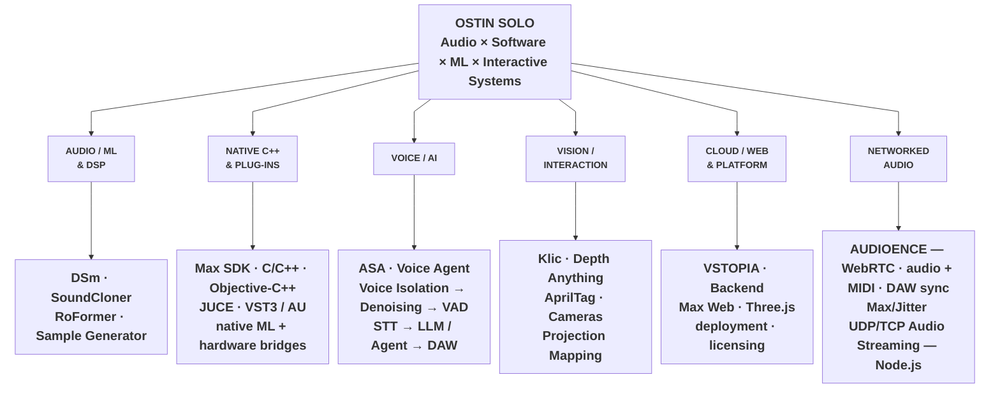

# Project & Technology Map

A deliberately **wide, shallow portfolio map** designed to keep the architecture visible in one view. OSTIN SOLO sits at the top, the main engineering domains share one horizontal band, and each domain has a single compact project/technology band beneath it.

## Portfolio architecture

## Native systems depth

The **Native C++ & Plug-ins** branch includes work that is easy to lose when projects are described only by product name:

- C and C++ components wrapped for the **Max SDK**, including interfaces between Max object APIs and reusable native engines.
- **Objective-C++ bridge layers** used where C++ systems need access to Apple/macOS frameworks and platform-specific APIs.
- Native communication layers for **hardware, sensors and operating-system services**, including lower-level macOS integration used by the Max external family.
- Custom bridges and runtime/resource layouts for embedding and distributing **machine-learning models and native inference components** with Max externals.
- JUCE/C++ development targeting **VST3, Audio Unit and standalone** applications.
- **Apple Developer Program** distribution workflow: Developer ID signing, Hardened Runtime and notarization for independently distributed macOS software and plug-ins.

## Recurring engineering themes

- **C++ / native systems:** Max externals, JUCE plug-ins, Objective-C++ bridges, hardware APIs, computer vision and neural-audio runtimes.
- **Audio ML:** source separation, synthesis reconstruction, CLAP/audio embeddings, classification, retrieval and model evaluation.
- **Interactive systems:** multitouch/MPE, Three.js graph interfaces, cameras, AprilTags, projection mapping and physical sensors.
- **Evaluation engineering:** benchmarks, controlled experiments, profiling, parity/regression testing and quantitative model/system comparisons.
- **Productisation:** experimental systems progressing toward native externals, VST3/AU/standalone software, Apple signing/notarization, deployment, licensing and commercial distribution.

The map is architectural rather than chronological: the projects share reusable technologies and research methods instead of existing as isolated experiments.
