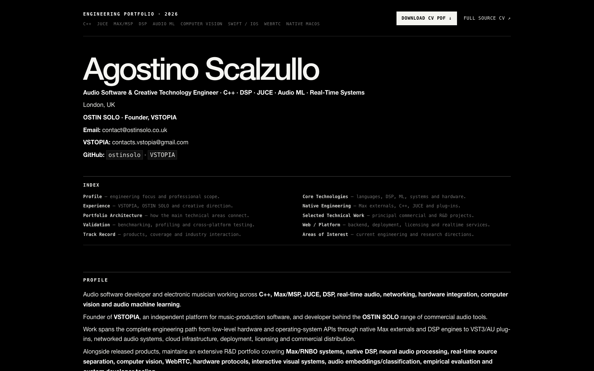

# Agostino Scalzullo — Master CV & Technical Portfolio

**Professional name:** OSTIN SOLO  
**Role:** Audio Software & Creative Technology Engineer · C++ · DSP · JUCE · Audio ML · Deep Learning · Real-Time Systems

## Live portfolio

### [Open the designed Master CV / Portfolio →](https://ostinsolo.github.io/ostin-solo-portfolio/)

**[View Live Portfolio](https://ostinsolo.github.io/ostin-solo-portfolio/)** · **[Download CV PDF — English](cv/Agostino_Scalzullo_CV_en.pdf)** · **[Recruiter CV](RECRUITER_CV.md)** · **[Master Technical CV](MASTER_CV_2026.md)**

**CV PDFs:** [EN](cv/Agostino_Scalzullo_CV_en.pdf) · [IT](cv/Agostino_Scalzullo_CV_it.pdf) · [ES](cv/Agostino_Scalzullo_CV_es.pdf) · [DE](cv/Agostino_Scalzullo_CV_de.pdf) · [FR](cv/Agostino_Scalzullo_CV_fr.pdf) · [中文](cv/Agostino_Scalzullo_CV_zh.pdf) · [日本語](cv/Agostino_Scalzullo_CV_ja.pdf)

The GitHub Pages version is the designed, browser-ready presentation of the master CV and technical portfolio.

Professional CV and technical portfolio covering audio software, native C++/Max engineering, VST3/AU development, DSP, audio ML, WebRTC, computer vision and interactive systems.

The master document is intentionally comprehensive. Short application-specific CVs can be derived from it for individual roles.

## Main documents

| File | Description |
|------|-------------|
| `MASTER_CV_2026.md` | Comprehensive master CV and primary source for tailored applications |
| `RECRUITER_CV.md` | Concise recruiter-facing CV |

## Portfolio architecture

The interactive portfolio contains the architecture overview directly in the web page, followed by expandable project sections.

## Professional links

- [Live Portfolio / Master CV](https://ostinsolo.github.io/ostin-solo-portfolio/)
- [OSTIN SOLO](https://ostinsolo.co.uk)
- [VSTOPIA](https://vstopia.com)
- [GitHub — ostinsolo](https://github.com/ostinsolo)
- [GitHub — VSTOPIA](https://github.com/VSTOPIA)
- [LinkedIn](https://www.linkedin.com/in/agostino-scalzullo-156952121)

## Selected public work

- **DSm — Dynamic Split Module:** neural stem separation, restoration and sampling environment for Ableton Live / Max for Live. DSm combines and substantially extends two earlier OSTIN SOLO projects: **Split Wizard+**, for neural source separation, and **YouTube 4 Live**, for web-based audio discovery and sampling inside Ableton Live.
- **Split Wizard+:** Demucs/Hybrid Transformer source separation integrated into Ableton Live.
- **ASA:** voice-controlled Ableton workflow with a large command set.
- **OpenMultitouch / Klic:** native multitouch and MPE-oriented Max/MSP externals, including `klic`, `klic.ui`, `lidangle`, `gyroscope` and `accelerometer`.
- **MPE VST3/AU:** JUCE/C++ expressive-performance plug-in work with per-voice channel allocation and Logic Pro-specific MIDI filtering/routing compatibility engineering.
- **AUDIOENCE:** C++/JUCE/WebRTC work on networked real-time audio, MIDI and DAW synchronisation.
- **Max/MSP UDP/TCP Audio Streaming:** public Max/Jitter + Node.js reference project for low-latency Float32 audio transport over UDP/TCP and downstream voice/audio processing. [Repository](https://github.com/ostinsolo/MaxMSP-Audio-via-UDP-for-voice-recognition)
- **Voice Isolation:** real-time target-speaker extraction using MossFormer2 + ECAPA with MPS/CUDA streaming.
- **Sample-Space Exploration:** CLAP/audio embeddings, classifier training, similarity retrieval, DSP analysis and a Three.js interactive graph for navigating audio collections.
- **Web-Based Max/MSP Environment:** browser-side object/patch graphs, Max/RNBO compatibility research, interface reconstruction and automated visual/behavioural parity testing. [Public demo — static preview](https://ostinsolo.github.io/max-object-network-demo/) — interactive 3D graph, Inspector/reference data and Help Patch viewer; Max/MSP, DSP, Jitter and Max for Live execution are disabled in this demo.

## Selected press & independent coverage

- [Sound On Sound — VSTOPIA announce Dynamic Split Module for Ableton](https://www.soundonsound.com/news/vstopia-announce-dynamic-split-module-ableton)
- [Gearnews — DSm: Dynamic Split Module für Ableton Live mit Max for Live](https://www.gearnews.de/elektron-tal-ni-ableton-sound-synth/)
- [AudioApp.cn / 音频应用 — Chinese coverage of Dynamic Split Module](https://www.audioapp.cn/thread-236856-1-1.html)
- [LAME / Max4Live Blog — Split Wizard](https://lame.buanzo.org/max4live_blog/unlocking-audio-separation-magic-a-comprehensive-guide-to-split-wizard-10v-for-ableton-live.html)
- [LAME / Max4Live Blog — ASA 1.2.8](https://lame.buanzo.org/max4live_blog/enhance-your-ableton-live-experience-with-asa-128-by-ostin-solo-a-comprehensive-device-overview.html)
- [LAME / Max4Live Blog — ASA Voice Controller](https://lame.buanzo.org/max4live_blog/unlocking-creativity-with-asa-ableton-voice-controller-a-comprehensive-guide.html)
- [LAME / Max4Live Blog — YouTube 4 Live 2.5](https://lame.buanzo.org/max4live_blog/discover-youtube-4-live-25-max-for-live-device-for-effortless-audio-streaming-and-web-browsing.html)
- [Gearnews — Pendolo coverage](https://www.gearnews.de/elektron-u-he-ni-moog-ableton-sounds/)

## Official ecosystem references

- [Cycling '74 — Dynamic Split Module: WebSampler with 63 Audio Separation models in Ableton](https://cycling74.com/projects/dynamic-split-module-websampler-with-63-audio-separation-models-in-ableton-1) — project listing in the official Max ecosystem.
- [Cycling '74 — Pendolo](https://cycling74.com/projects/pendolo) — official Max ecosystem project page for the physics-based MIDI generator and sound-design tool.

## Industry connection — Connor McDonough

**Preview Tuner** was developed from a production-workflow concept by **Connor Patrick McDonough**, a multi-platinum, ASCAP award-winning songwriter and producer with three #1 records, according to Artist Publishing Group.

- [McDonough Productions](https://www.mcdonoughproductions.com/) — official McDonough production website and selected production/songwriting credits.
- [Artist Publishing Group — Connor McDonough](https://www.artistpg.com/producers/connormcdonough) — industry profile documenting his multi-platinum status, ASCAP award and three #1 records.

## Contact

- **OSTIN SOLO:** contact@ostinsolo.co.uk
- **VSTOPIA:** contacts.vstopia@gmail.com

## License

Personal portfolio / CV materials. All rights reserved.
